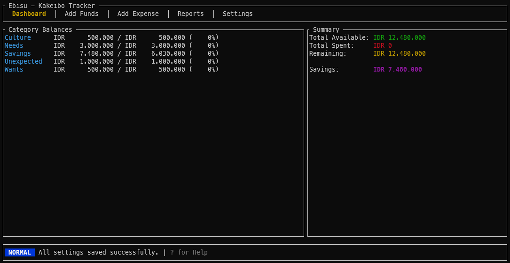

# Ebisu TUI 🦀💰

A blazing fast, terminal-based personal finance tracker implementing the **Kakeibo** (Japanese household ledger) method. Built with Rust.



## ✨ Features

*   **Kakeibo Methodology**: Automatically allocates income into configurable categories (Need, Want, Culture, Unexpected).
*   **Rollover System**: Unspent funds automatically roll over to your "Savings" buffer.
*   **Overflow Protection**: Expenses exceeding a category limit automatically dip into "Unexpected" or "Savings" (no invisible debt!).
*   **Batch Configuration**: Edit your budget percentages in real-time and save them in one go.
*   **Local & Fast**: Powered by SQLite (`libsql`) and `ratatui` for instant interactions.
*   **Privacy First**: All data lives locally on your machine.

---

## 🚀 Getting Started

### Prerequisites
*   [Rust](https://www.rust-lang.org/tools/install) (latest stable)
*   A terminal (Alacritty, WezTerm, iTerm2, etc.)
*   A Nerd Font (recommended for icons, though currently text-heavy)

### Installation

**From Source:**

1.  Clone the repository:
    ```bash
    git clone https://github.com/yourusername/ebisu-tui.git
    cd ebisu-tui
    ```

2.  Run the application:
    ```bash
    cargo run --release
    ```

The database (`ebisu.db`) will be automatically created in the current directory.

---

## 🎮 Usage Guide

### Navigation Keys
| Key | Action |
| :--- | :--- |
| `Tab` / `Shift+Tab` | Switch between Tabs (Dashboard, Payday, Expense, Settings, Reports, Help) |
| `↑` / `↓` (`j`/`k`) | Navigate lists and menus |
| `Enter` | Select item / Confirm action / Save form |
| `i` | Enter **Insert Mode** (to type numbers/text) |
| `Esc` | Exit **Insert Mode** / Cancel action |
| `?` | Toggle Help Overlay |
| `q` | Quit Application |

### Core Workflows

#### 1. Setup Your Budget (Settings Tab)
*   Navigate to the **Settings** tab.
*   Adjust the "Limit %" for each category (Needs, Wants, Culture).
*   Ensure the Total Allocation is 100%.
*   Select **[ SAVE CHANGES ]** at the bottom to persist your budget.

#### 2. Payday! (Add Funds Tab)
*   When you receive income (Salary, Bonus), go to **Add Funds**.
*   Enter the amount.
*   **Magic happens**: The app distributes funds to categories based on your Settings. Any unspent money from previous periods is swept into **Savings**.

#### 3. Log Expenses (Add Expense Tab)
*   Select a category (e.g., "Culture").
*   Enter the cost and a description.
*   If you overspend, the app will warn you and automatically deduce from "Unexpected" or "Savings".

#### 4. Analyze (Reports Tab)
*   View your spending history.
*   Use `h`/`l` (Left/Right) to change the date range (Today, 7 Days, Month, Year).

---

## 🧠 How It Works (For Experts)

### The Kakeibo Logic
Unlike standard budget apps that just "warn" you, Ebisu enforces logic:
1.  **Strict Allocation**: every dollar is given a job the moment it enters the system.
2.  **Waterfall Overflow**: `Category Spend > Category Balance` → `Unexpected Fund` → `Savings`.

### Tech Stack
*   **UI**: `ratatui` + `crossterm` for the rendering loop.
*   **Async**: `tokio` runtime handling non-blocking database IO.
*   **DB**: `libsql` (SQLite dialect) storing formatted timestamps (RFC3339) to ensure timezone consistency.
*   **Math**: `rust_decimal` for precise financial calculations (no floating point errors).

### Project Structure
*   `src/state.rs`: The central source of truth (Model).
*   `src/app.rs`: The main event loop and rendering logic (Controller/View).
*   `src/database.rs`: Encapsulated async SQL queries.
*   `src/action.rs`: Enum-based intent system (The Elm Architecture pattern).

---

## 🤝 Contributing

We welcome contributions! Please see our internal developer guides for deep dives:
*   [**RUST_TUI_GUIDE.md**](RUST_TUI_GUIDE.md): A comprehensive book on how this app was built.
*   [**DEVELOPMENT_KNOWLEDGE.md**](DEVELOPMENT_KNOWLEDGE.md): Architecture decisions and DB schema.

**License**: MIT
